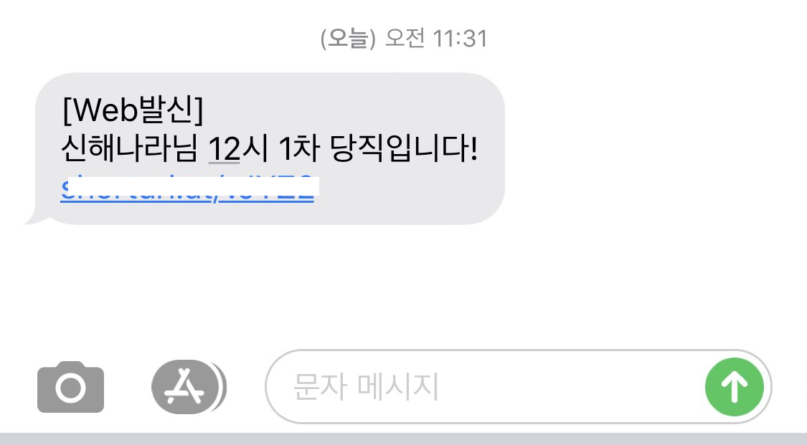

Lunch_Shift_Alert_SMS_Sender
=========================================================

**🥪 점심당직알림 문자발송 서비스**

# Purpose
점심 당직자가 까먹지 않도록 점심시간 이전에 미리 SMS 문자를 발송하여 까먹지 않게 한다. 또한 당직명단 관리자는 당직 명단을 구글 시트를 통해 간단하게 관리한다.

# How it works
## 당직자 미리 알림
-	💁 누구에게 : 당일 당직자 2명 (12:00~12:30, 12:30~13:00)
-	⏰ 언제     : 당일 당직 전 (11:30, 12:25)
-	✉️ 어떻게   : SMS 발송 1회 ([CoolSMS API](https://www.coolsms.co.kr/) 서비스)

## 당직자 명단 관리 
-	📅 매월 당직자 명단을 업로드 및 수정
-	☎️ 당직자의 연락망을 업로드 및 수정
-	📄 Google Docs를 이용하여 당직자 명단 문서 공유 및 관리


# Google Sheet Sample Format

- [당직명단 Sheet 샘플](https://docs.google.com/spreadsheets/d/1f87DW8pXLpiEW_H50DqvqpDUkO85JTPnfbdtR0m9ssE/edit?usp=sharing)

- [연락처명단 Sheet 샘플](https://docs.google.com/spreadsheets/d/1uMz5Vvlfflc_xovGrcgWom-05176lGdZK57YmZW8CqE/edit?usp=sharing)


# Setup

## 라이브러리 설치 

### CoolSMS SDK 설치
```
$ pip install coolsms
$ pip install coolsmssdk
```
[CoolSMS SDK Github Link](https://github.com/coolsms/python-sdk/releases)

### Google Sheet SDK 설치
```
$ pip install gspread
```


## Config 설정

Google Sheet API 및 CoolSMS API 연동을 위해서는 아래와 같리 설정해줘야 한다. 
- [Google Sheet API Key 발급](https://console.developers.google.com/flows/enableapi?apiid=sheets.googleapis.com)
- [CoolSMS API Key 발급](https://www.coolsms.co.kr/index.php?mid=service_setup&act=dispSmsconfigCredentials)

### config.py
- api_key : CoolSMS API Key
- api_secret : CoolSMS API Secret
- sender : SMS 발신 번호
- URL : 문자에 포함 할 당직명단 Short URL
- supervisor : 당직명단 관리자 전화번호
- sys_admin_phone : 시스템 관리자 전화번호

### key.json
- key.json은 Google Api 발급 후 사용자 인증정보(Client ID) 발급 시 제공되는 JSON 파일을 key.json으로 저장하면 된다.


# Basic Usage
```
$ python main.py
```

# Example Message
****

- 당직 시간이 되면 위와 같이 문자를 수신한다. 


License
--------

    Copyright (c) 2019 HAREX Infotech.
    Licensed under the Apache License, Version 2.0 (the "License");
    you may not use this file except in compliance with the License.
    You may obtain a copy of the License at

       http://www.apache.org/licenses/LICENSE-2.0

    Unless required by applicable law or agreed to in writing, software
    distributed under the License is distributed on an "AS IS" BASIS,
    WITHOUT WARRANTIES OR CONDITIONS OF ANY KIND, either express or implied.
    See the License for the specific language governing permissions and
    limitations under the License.